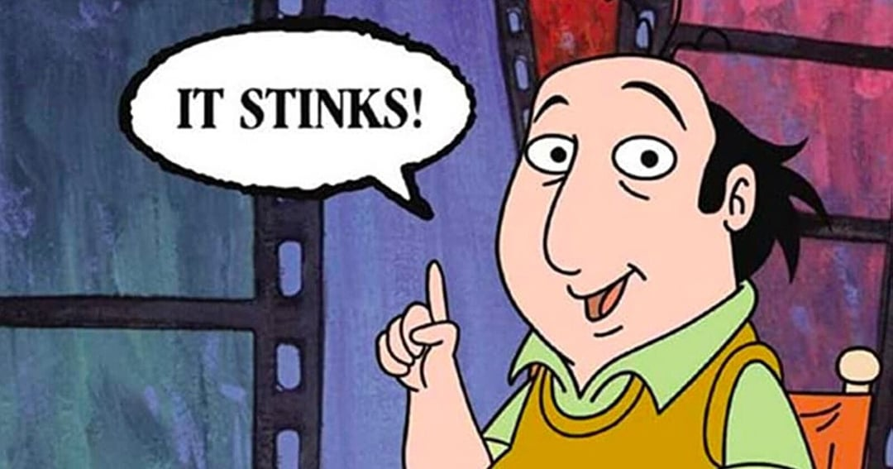
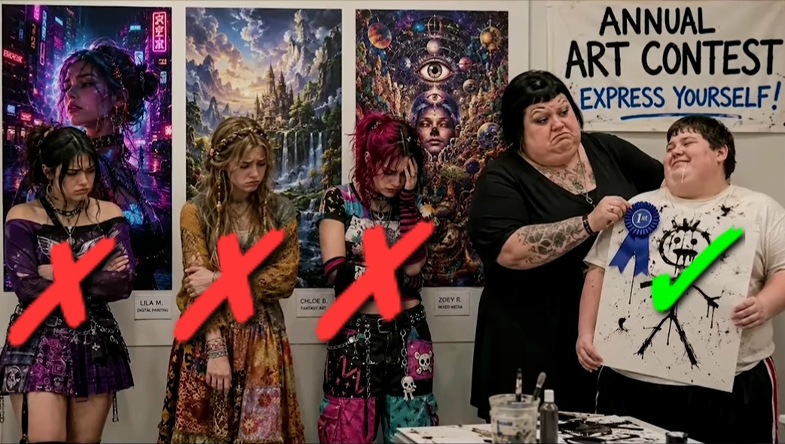
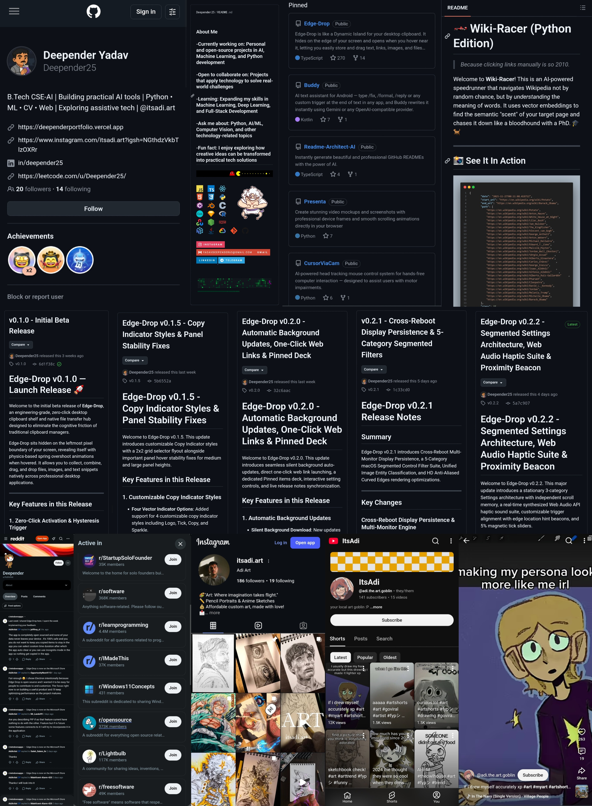

# TheCritic

- As much as I prefer not being the bearer of bad news, there are times when oneself truly cannot be helped. Allow me to demonstrate. That thing you refer to as a tool...in actuality sucks royal anuses. Let's talk about it, or not and say we did. Displeased to find you or your application referenced here? Feeling less than appreciative of the mention? That's unfortunate.
- It isn't remotely you, not even close. Is it any wonder why the development scene is currently rampant with syndromes, including the media? It's disgusting to watch, and even worse for earnest participants. That is, if there's any left.

## The Olympics won't tolerate it

- It's the steroids talking, quit stealing the show. You can stop flexing.

## The art world isn't having it

## Why is the software development community turning a blind eye?

- Unfortunately, this demographic are the primary beneficiaries & receivers of industry kick-backs, clearly invested in driving humanity off a cliff. This isn't a new renaissance, or an equity movement for the have-nots in skills or creativity, it's the beginning of the end for both.

- You're nothing without your phoney abilities, prosthetic brain, personas, or what essentially amounts to your existence. Imposters.

